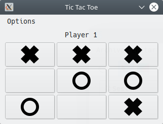

# TIC-TAC-TOE-game
A classic game (tic-tac-toe) made with wxpython.

So, if you want to be able to run the script is necessary to install wxpython in python 3.

You just have to run the script and the game will start in a two players game, then each player will have to click on the buttons and you can see player's turn on the top. When somebody wins you will be able to restart the game but if you click on 'No' you will be able to restart the game in the menu options.

## Game aspect

## Author
**Enzo Enrique Falcón Astuhuayhua**
